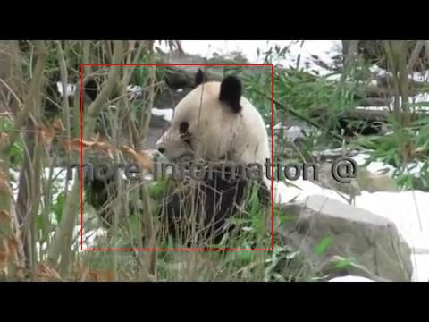
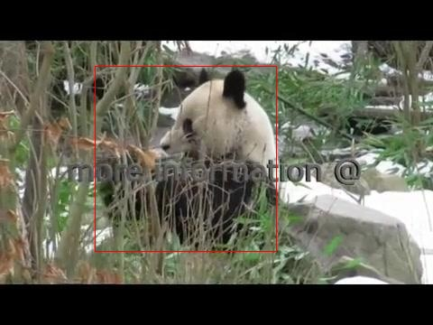
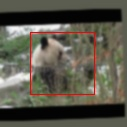
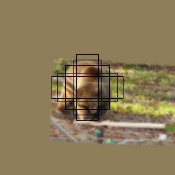
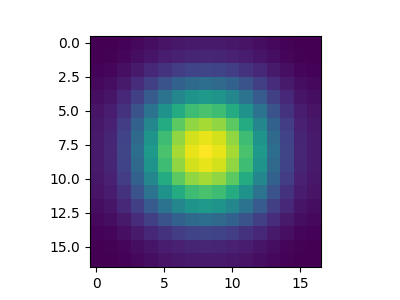

# SiamRPN

## Dataset

### Download

下载[ILSVRC2015_VID.tar.gz](http://bvisionweb1.cs.unc.edu/ilsvrc2015/ILSVRC2015_VID.tar.gz)，解压至`data/`，目录结构如下
```
├── ILSVRC2015_VID
│   └── ILSVRC2015
│       ├── Annotations
│       ├── Data
│       └── ImageSets
└── ILSVRC2015_VID.tar.gz
```

### Load Data

- 设置模板(`template`)图像尺寸为$127 \times 127$，待搜索(`search`)图像尺寸为$255 \times 255$；
- 从同属一个视频的图片序列中选取两帧，间隔不超过$20$帧，考虑到同一图片中可能存在多个物体标记，随机选择两帧中共同出现的某个物体作为跟踪样本；
- 在裁剪图片时，以标注框(bbox)为中心，记其高宽分别为$h, w$，按下式计算裁剪图像尺寸(a)，再缩放至所需尺寸$size \times size$
    $$ p = \frac{w + h}{2} \times \frac{size}{127} $$
    
    $$ a = \sqrt{(w + p)(h + p)} $$

- 数据扩增：高斯模糊(blur)、随机旋转(rotate=5)、随机缩放(scale=0.05)、颜色抖动、随机翻转；
- 将search图像中随机偏移(mshift=32)，使之不位于图像中心；
- 数据缩放至$[0, 1.]$；

载入的原始图像如下




截取图像如下



## Model

模型分为backbone与head两部分
1. backbone
    选取`Alexnet`，用于提取图像特征，在输入$z$与$x$图像共享权值，即孪生网络；对于`template`输入$3 \times 127 \times 127$，输出特征图$\phi(z)$尺寸为$256 \times 6 \times 6$，对于`search`输入$3 \times 255 \times 255$，输出特征图$\phi(x)$尺寸$256 \times 22 \times 22$，**注意网络$stide=8$**。

2. head
    参考RPN网络，首先将$\phi(z)$进行卷积得到$[\phi(z)]_{cls}$($(256\times 2k) \times 4 \times 4$)与$[\phi(z)]_{reg}$($(256\times 4k) \times 4 \times 4$)，将$\phi(x)$进行卷积得到$[\phi(x)]_{cls}$($256 \times 20 \times 20$)与$[\phi(x)]_{cls}$($256 \times 20 \times 20$)，通过下式计算互相关，得到最终输出，以下$k$表示anchor数($k=5$)
    $$ A^{cls}_{2k \times 17 \times 17} = [\phi(z)]_{cls} * [\phi(x)]_{cls} $$

    $$ A^{reg}_{4k \times 17 \times 17} = [\phi(z)]_{reg} * [\phi(x)]_{reg} $$

## Training Step(offline)

1. Anchor

    - 设置ratio为$ratio=[0.33, 0.5, 1.0, 2.0, 3.0]$的锚框，尺度设置一种为$scale=[8]$，共$17 \times 17 \times(5 \times 1) = 1445$；
    - 网络步长$stride=8$，即输出特征图$A^{cls/reg}$相邻两坐标，对应$z$与$x$做互相关运算时，窗口滑动$8$个像素；

    可视化情况如下
    

2. Loss

    计算真实框$T$与所有anchor$A$之间$IOU$

    1. 分类

        - 对于每对样本，共采样保留$64$个Anchor，其中正例($IOU>0.6$)最多保留$16$个，其余为负例($IOU<0.3$)，计算交叉熵损失$loss^{(i)}_{cls}$；
        - 根据$gt_bbox$位置，增加对远离中心(曼哈顿距离大于$2$)的Anchor惩罚$loss^{(i)}_{ct}$；
        - 最终分类损失为
            $$ Loss_{cls} = \frac{1}{N} \sum_{i} loss^{(i)}_{cls} + \lambda_{ct} loss^{(i)}_{ct} $$

    2. 回归

        对正例($IOU > 0.6$)进行坐标的回归，计算$T$相对于各anchor的偏移量，$i,j$分别为样本、anchor索引
        $$
        \begin{cases}
            gt^{(i, j)}_{cx} = \frac{T^{(i)}_{cx} - A^{(j)}_{cx}}{A_w} \\
            gt^{(i, j)}_{cy} = \frac{T^{(i)}_{cy} - A^{(j)}_{cy}}{A_h} \\
            gt^{(i, j)}_{w}  = \ln \frac{T^{(i)}_w}{A^{(j)}_w} \\
            gt^{(i, j)}_{h}  = \ln \frac{T^{(i)}_h}{A^{(j)}_h}
        \end{cases}
        $$
        
        由于误差较大且波动幅度大，采用$L1$损失不易发散
        $$ Loss_{reg} = \frac{1}{N} \sum_{i} \frac{1}{n_p} \sum_{j} L1(pred^{(i, j)}, gt^{(i, j)}) $$

    最终损失为
    $$ Loss = \lambda_{cls} Loss_{cls} + \lambda_{reg} Loss_{reg} $$

3. Others

    Adam优化器($lr=0.001, decay=5e-4$，指数学习率衰减($\gamma=0.9$)，批次大小$48$，梯度范数剪裁($10$)，共迭代$80$代。详细参数设置查看`main/config.py/configer.siamrpn`。

## Tracking Step(online)

1. 指定初始帧，与[dataset](#dataset)中裁剪template的方式一致，得到$z_{3 \times 127 \times 127}$，用网络提取其特征$\phi(z)$；
2. 按初始帧中的边界框裁剪search得到$z_{3 \times 255 \times 255}$，经过特征提取、互相关运算得到$A^{cls}_{2k \times 17 \times 17}$与$A^{reg}_{4k \times 17 \times 17}$；
3. 按下式计算预测边界框
    $$
    \begin{cases}
    T_{cx} = A^{reg}[0] \times A_w + A_{cx} \\
    T_{cy} = A^{reg}[1] \times A_h + A_{cy} \\
    T_w = e^{A^{reg}[2]} \times A_w \\
    T_h = e^{A^{reg}[3]} \times A_h 
    \end{cases}, \text{shape}(4k, 17, 17)
    $$

    $$ score = \text{softmax} (A^{cls}) [1], \text{shape}(k, 17, 17) $$

4. 为减少干扰，增加尺寸惩罚
    $$ penalty = e^{k \times \max(\frac{r}{r'}, \frac{r'}{r}) \times \max(\frac{s}{s'}, \frac{s'}{s})} $$    

    其中$r'$为上帧输出边界框长宽比$r'=\frac{w'}{h'}$，$s'$为上帧输出边界框尺寸$s'=\sqrt{(w + p) (h + p)}, p=\frac{w+h}{2}$，$r,s$为预测输出的长宽比与尺寸，那么惩罚后的各框评分为
    $$ pscore = score \times penalty, \text{shape}(k, 17, 17) $$

5. 增加hamming窗，减少边界影响

    hamming窗可视化如下
    

    $$ pscore = pscore \times hamming, \text{shape}(k, 17, 17) $$

6. 选择评分最高的作为待搜索帧的边界框

    减少尺寸突变，增加动量项
    $$
    \begin{cases}
        w = w \times momentum + w' \times (1 - momentum) \\
        h = h \times momentum + h' \times (1 - momentum)
    \end{cases}
    $$

    其中$momentum = m \times pscore$，$m$为超参数。